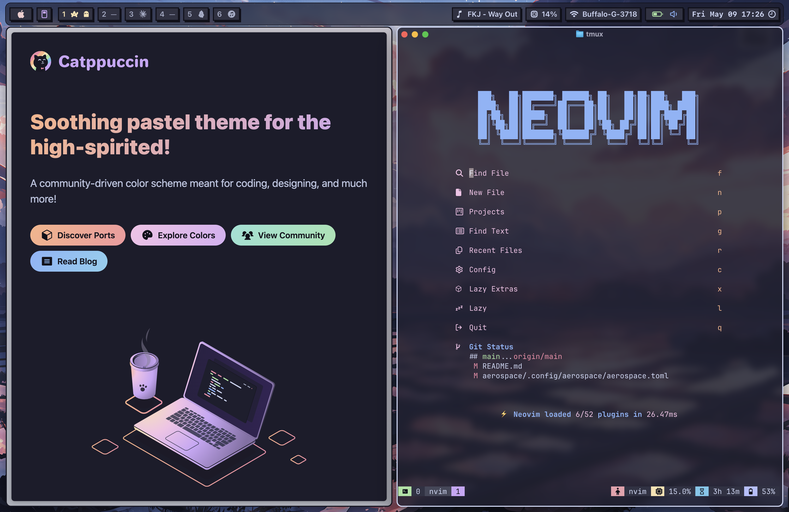
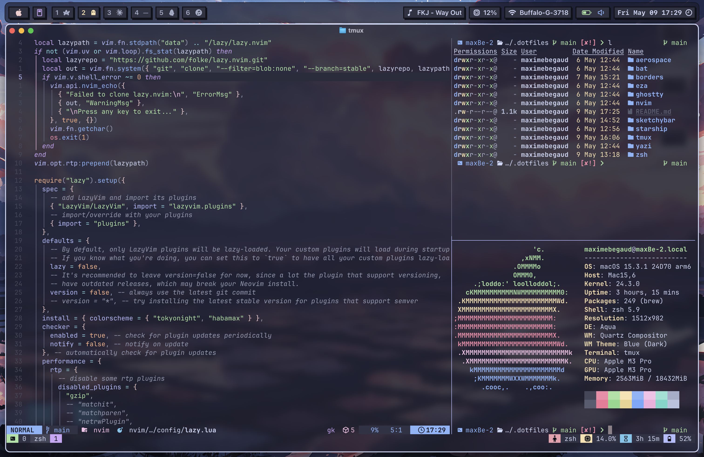

# Dotfiles @ MaxBe

Stitching together stuffs I found on the internet and modified to fit my needs.

## Looks

Font: mostly Fira Code & SF Pro (Nerd Fonts).  
Theme: catppuccin mocha. It integrates well everywhere, on top of having nice colors.

[See catppuccin integrations](https://catppuccin.com/).  





## Dev workflow

- **Terminal:** [Ghostty](https://github.com/ghostty-org/ghostty)
- Editor: Neovim with [Lazyvim](https://github.com/LazyVim/LazyVim)
- **Shell:** [zsh](https://www.zsh.org/)
- **Browser:** [Arc](https://arc.net/)/[Ladybird](https://ladybird.org/)
- **Notes:** [Obsidian](https://obsidian.md/)
- **WM:** [Aerospace](https://github.com/nikitabobko/AeroSpace) + [jankyborders](https://github.com/FelixKratz/JankyBorders)
- **Bar:** [Sketchybar](https://github.com/FelixKratz/SketchyBar)

## CLI tools

- **Terminal sessions:** [tmux](https://github.com/tmux/tmux)
- **ls alternative:** [eza](https://github.com/eza-community/eza)
- **cat alternative:** [bat](https://github.com/sharkdp/bat)
- **files management:** [yazi](https://github.com/sxyazi/yazi)
- **prompt:** [starship](https://github.com/starship/starship)

## Stow to install

```bash
# whatever you want to copy
stow nvim tmux zsh

# or everything
stow .
```
